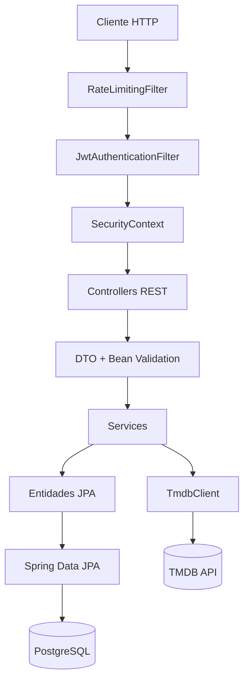
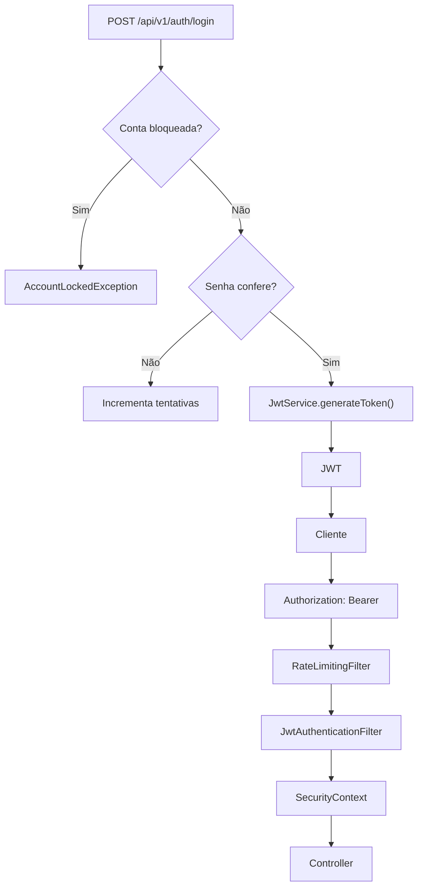

# WatchuSee Backend

[](https://openjdk.org/projects/jdk/21/)
[](https://spring.io/projects/spring-boot)
[](https://spring.io/projects/spring-security)
[](https://spring.io/projects/spring-data-jpa)
[](https://www.postgresql.org/)
[](https://jwt.io/)
[](https://www.openapis.org/)
[](https://swagger.io/)
[](https://maven.apache.org/)
[](https://www.docker.com/)
[](https://junit.org/junit5/)

**API REST do WatchuSee**, responsável por descoberta de filmes via TMDB, watchlist pessoal, perfis, amizades e compartilhamento de recomendações entre usuários, com autenticação JWT própria e persistência em PostgreSQL.

A documentação técnica completa — entidades, DTOs, services, segurança, débito técnico conhecido e decisões arquiteturais — está em **[docs/ARCHITECTURE.md](docs/ARCHITECTURE.md)**. Este README cobre apenas o essencial para rodar o projeto e entender o que ele faz.

**API ao vivo:** [watchusee-backend.onrender.com](https://watchusee-backend.onrender.com)
**Swagger UI:** [watchusee-backend.onrender.com/swagger-ui/index.html](https://watchusee-backend.onrender.com/swagger-ui/index.html)
**Aplicativo Android:** [watchusee-android](https://github.com/jzmlucas/watchusee-android)

> A API roda em uma instância gratuita do Render, que hiberna sem tráfego. A primeira requisição depois de um período ocioso pode levar alguns segundos a mais para responder.

## Sobre o projeto

O WatchuSee reúne três funções que costumam ser separadas em outros aplicativos:

- **Descoberta de filmes** através da API do TMDB.
- **Watchlist pessoal**, com os estados `TO_WATCH` e `WATCHED`.
- **Recursos sociais**: amizades e compartilhamento de recomendações entre usuários.

A API mantém o contrato do TMDB isolado do cliente através de DTOs e mapeadores próprios — o cliente do WatchuSee nunca fala diretamente o "formato" do TMDB.

## Funcionalidades

- Cadastro e login com JWT.
- Logout com revogação de token.
- Troca de senha e invalidação de sessões anteriores.
- Bloqueio temporário de conta após tentativas de login inválidas.
- Busca e perfis de usuários.
- Avatar por ícones predefinidos e filme favorito.
- Busca, detalhes, tendências, populares, em cartaz, próximos lançamentos, similares, recomendações, avaliações, listas e trailer de filmes.
- Watchlist paginada e filtrável por status, incluindo consulta da watchlist de outros usuários.
- Solicitações de amizade: enviar, aceitar/recusar, listar, contar e consultar status do relacionamento.
- Compartilhamento de filmes entre usuários.
- Rate limiting para autenticação, cadastro e endpoints públicos de filmes.
- Tratamento global e consistente de erros (`GlobalExceptionHandler`).
- OpenAPI/Swagger disponível em `/swagger-ui/index.html`.

## Arquitetura

Layered architecture organizada por **package-by-feature**: cada módulo de negócio (`user`, `movie`, `watchlist`, `friend`, `share`) concentra sua própria entidade, repository, service, controller e DTOs.

<details>
<summary>Ver diagrama de arquitetura</summary>



</details>

<details>
<summary>Ver fluxo de autenticação</summary>



</details>

Detalhes de componentes, autorização e mitigação de SSRF na integração com o TMDB estão em [docs/ARCHITECTURE.md](docs/ARCHITECTURE.md#autenticação-e-segurança).

## API

Prefixo: `/api/v1`

| Recurso | Principais endpoints |
|---|---|
| Auth | `/auth/login`, `/auth/logout` |
| Users | `/users`, `/users/search`, `/users/me/profile`, `/users/{userId}/profile` |
| Movies | `/movies/search`, `/movies/{movieId}`, `/movies/trending/*`, `/movies/popular`, `/movies/upcoming` |
| Watchlist | `/watchlist`, `/users/{userId}/watchlist` |
| Friends | `/friends`, `/friends/requests/*`, `/friends/status/{userId}` |
| Shares | `/shares`, `/shares/received`, `/shares/pending`, `/shares/sent` |

A lista completa de endpoints, parâmetros, DTOs e status HTTP está em **[docs/ARCHITECTURE.md](docs/ARCHITECTURE.md#api--endpoints)**.

## Banco de dados

- PostgreSQL hospedado no Supabase.
- Spring Data JPA + Hibernate, schema `app`.
- `spring.jpa.open-in-view=false` — sem lazy loading implícito na camada web.
- `ddl-auto=update` (sem Flyway/Liquibase — ver limitações abaixo).
- Persistência de usuários, filmes referenciados, watchlists, amizades e compartilhamentos.

## Integração externa

O TMDB é a única fonte externa de dados de filmes. A aplicação tem um `TmdbClient` próprio, com whitelist de hosts, validação de certificado TLS e retry com backoff exponencial contra falhas transitórias — detalhes em [docs/ARCHITECTURE.md](docs/ARCHITECTURE.md#integração-externa-com-tmdb).

## Como executar

### Pré-requisitos

- Java 21
- Maven Wrapper incluído no projeto (não precisa de Maven instalado globalmente)
- PostgreSQL/Supabase
- API Key do TMDB

### Configuração

Defina as variáveis de ambiente utilizadas pela aplicação:

```bash
export TMDB_API_KEY="sua_chave"
export SUPABASE_URL="jdbc:postgresql://<host>:<porta>/<database>"
export SUPABASE_USERNAME="seu_usuario"
export SUPABASE_PASSWORD="sua_senha"
export JWT_SECRET="sua_chave_jwt_com_pelo_menos_32_caracteres"
export DUMMY_PASSWORD_HASH="hash_bcrypt_qualquer"
```

`DUMMY_PASSWORD_HASH` é obrigatória: é um hash BCrypt fixo usado para igualar o tempo de resposta do login quando o nick não existe (mitigação de enumeração de usuários). **Sem ela, a aplicação não sobe.** A lista completa de variáveis, com as opcionais e seus defaults, está em [docs/ARCHITECTURE.md](docs/ARCHITECTURE.md#variáveis-de-ambiente).

Depois:

```bash
./mvnw spring-boot:run
```

### Docker

```bash
docker build -t watchusee-backend .
docker run -p 8080:8080 \
  -e TMDB_API_KEY="sua_chave" \
  -e SUPABASE_URL="jdbc:postgresql://<host>:<porta>/<database>" \
  -e SUPABASE_USERNAME="seu_usuario" \
  -e SUPABASE_PASSWORD="sua_senha" \
  -e JWT_SECRET="sua_chave_jwt" \
  -e DUMMY_PASSWORD_HASH="hash_bcrypt_qualquer" \
  watchusee-backend
```

> O `docker-compose.yml` do repositório ainda não repassa `DUMMY_PASSWORD_HASH` ao serviço `app` — adicione-a manualmente (ex. via `docker-compose.override.yml`) antes de rodar `docker compose up`, ou o container sobe e cai imediatamente no boot.

## Testes

```bash
./mvnw clean test
```

Cobertura atual: unit tests de todos os services (Mockito + AssertJ) e testes dedicados de `JwtService`/blacklist de token. Não há ainda testes de controller (`@WebMvcTest`) nem de integração ponta a ponta — detalhes em [docs/ARCHITECTURE.md](docs/ARCHITECTURE.md#testes).

## Notas de segurança

- A documentação OpenAPI está disponível publicamente em `/swagger-ui/index.html` e `/v3/api-docs`, desabilite em produção se isso não for desejado.
- `ddl-auto=update` aplica alterações de schema automaticamente a cada boot; não é recomendado para produção com dados reais sem uma estratégia de migração (Flyway/Liquibase).
- Autorização de recurso (dono vs. terceiros) é feita manualmente em cada service, não via `@PreAuthorize`, ver [Autorização](docs/ARCHITECTURE.md#autorização--como-o-sistema-impede-acesso-a-dados-de-outros-usuários) no documento técnico.
- Rate limiting e blacklist de token são em memória, por instância — não sobrevivem a reinício e não são compartilhados entre réplicas.

## Documentação detalhada

A documentação técnica aprofundada está separada para manter este README objetivo:

**[Arquitetura e documentação técnica](docs/ARCHITECTURE.md)**

Ela contém: entidades e relacionamentos, DTOs, services, repositories, controllers, segurança e JWT, banco de dados, integração TMDB, todos os endpoints, validações, tratamento de erros, dependências, testes, decisões arquiteturais, débito técnico/bugs conhecidos e melhorias futuras.

## Autor

Desenvolvido por **Lucas Joly**.

[](https://linkedin.com/in/jzmlucas)
[](https://github.com/jzmlucas)