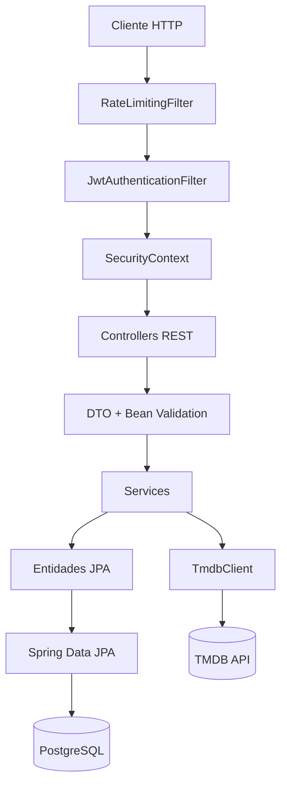
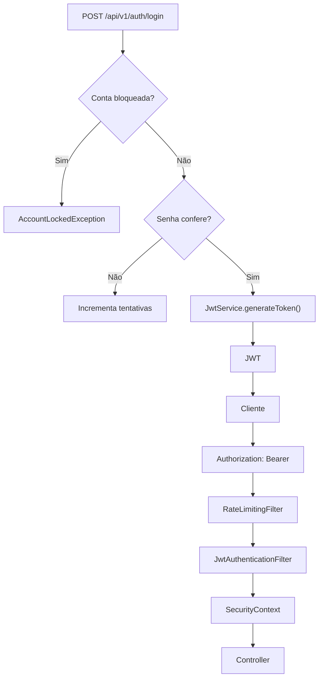

# WatchuSee Backend

## Tecnologias

[](https://openjdk.org/projects/jdk/21/)
[](https://spring.io/projects/spring-boot)
[](https://spring.io/projects/spring-security)
[](https://spring.io/projects/spring-data-jpa)
[](https://www.postgresql.org/)
[](https://jwt.io/)
[](https://www.openapis.org/)
[](https://swagger.io/)
[](https://maven.apache.org/)
[](https://www.docker.com/)
[](https://junit.org/junit5/)

**API REST do WatchuSee**, responsável por descoberta de filmes via TMDB, watchlist pessoal, perfis, amizades e compartilhamento de recomendações entre usuários, com autenticação JWT e persistência em PostgreSQL.  

A documentação completa de endpoints, parâmetros, DTOs, status HTTP e regras de negócio está em **[docs/ARCHITECTURE.md](docs/ARCHITECTURE.md)**.

**API ao vivo:** [watchusee-backend.onrender.com](https://watchusee-backend.onrender.com)  
**Swagger UI:** [watchusee-backend.onrender.com/swagger-ui/index.html](https://watchusee-backend.onrender.com/swagger-ui/index.html)  
**Aplicativo Android:** [watchusee-android](https://github.com/jzmlucas/watchusee-android)

## Sobre o projeto

O WatchuSee reúne três funções que são separadas em outros aplicativos:

- **Descoberta de filmes** através da API do TMDB.
- **Watchlist pessoal**, com os estados `TO_WATCH` e `WATCHED`.
- **Recursos sociais**, incluindo amizades e compartilhamento de recomendações.

A API mantém o contrato do TMDB isolado do cliente através de DTOs e mapeadores próprios.

## Funcionalidades

- Cadastro e login com JWT.
- Logout com revogação de token.
- Troca de senha e invalidação de sessões anteriores.
- Bloqueio temporário após tentativas de login inválidas.
- Busca e perfis de usuários.
- Avatar por ícones predefinidos.
- Filme favorito.
- Busca, detalhes, tendências, populares, em cartaz, próximos lançamentos, similares, recomendações, avaliações, listas e trailer.
- Watchlist paginada e filtrável por status.
- Consulta da watchlist de outros usuários.
- Solicitações de amizade, aceite/recusa, listagem, contagem e status do relacionamento.
- Compartilhamento de filmes entre usuários.
- Rate limiting para autenticação e endpoints públicos de filmes.
- Tratamento global e consistente de erros.
- OpenAPI/Swagger.

##  Arquitetura

O backend utiliza **Layered Architecture**, organizada por **package-by-feature**.

<details>
<summary>Ver arquitetura</summary>



</details>

### Fluxo de autenticação

<details>
<summary>Ver fluxo de autenticação</summary>



</details>

## API

Prefixo: `/api/v1`

| Recurso | Principais endpoints |
|---|---|
|  Auth | `/auth/login`, `/auth/logout` |
|  Users | `/users`, `/users/search`, `/users/me/profile`, `/users/{userId}/profile` |
|  Movies | `/movies/search`, `/movies/{movieId}`, `/movies/trending/*`, `/movies/popular`, `/movies/upcoming` |
|  Watchlist | `/watchlist`, `/users/{userId}/watchlist` |
|  Friends | `/friends`, `/friends/requests/*`, `/friends/status/{userId}` |
|  Shares | `/shares`, `/shares/received`, `/shares/pending`, `/shares/sent` |

A documentação completa de endpoints, parâmetros, DTOs, status HTTP e regras de negócio está em **[docs/ARCHITECTURE.md](docs/ARCHITECTURE.md)**.

##  Banco de dados

- PostgreSQL hospedado no Supabase.
- Spring Data JPA + Hibernate.
- Schema `app`.
- `spring.jpa.open-in-view=false`.
- Persistência de usuários, filmes referenciados, watchlists, amizades e compartilhamentos.

## Integração externa

O TMDB é utilizado como fonte de dados de filmes.

A aplicação possui um `TmdbClient` próprio e mantém os DTOs do TMDB separados dos DTOs expostos pela API.

## Como executar

### Pré-requisitos

- Java 21
- Maven Wrapper incluído no projeto
- PostgreSQL/Supabase
- API Key do TMDB

### Configuração

Defina as variáveis de ambiente utilizadas pela aplicação:

```bash
export TMDB_API_KEY="sua_chave"
export SUPABASE_URL="jdbc:postgresql://<host>:<porta>/<database>"
export SUPABASE_USERNAME="seu_usuario"
export SUPABASE_PASSWORD="sua_senha"
export JWT_SECRET="sua_senha_jwt"
```

Depois:

```bash
./mvnw spring-boot:run
```

### Docker

```bash
docker build -t watchusee-backend .
docker run -p 8080:8080   -e TMDB_API_KEY="sua_chave"   -e SUPABASE_URL="jdbc:postgresql://<host>:<porta>/<database>"   -e SUPABASE_USERNAME="seu_usuario"   -e SUPABASE_PASSWORD="sua_senha"   -e JWT_SECRET="sua_chave"   watchusee-backend
```

## Documentação detalhada

A documentação técnica aprofundada está separada para manter este README objetivo:

 **[Arquitetura e documentação técnica](docs/ARCHITECTURE.md)**

Ela contém:

- classes e responsabilidades;
- entidades e relacionamentos;
- DTOs;
- Services;
- Repositories;
- Controllers;
- segurança e JWT;
- banco de dados;
- integração TMDB;
- todos os endpoints;
- validações;
- tratamento de erros;
- dependências;
- testes;
- decisões arquiteturais;
- problemas encontrados;
- melhorias futuras.

## Testes

Execute:

```bash
./mvnw clean test
```

## Autor

Desenvolvido por **Lucas Joly**.

[](https://linkedin.com/in/jzmlucas)
[](https://github.com/jzmlucas)
