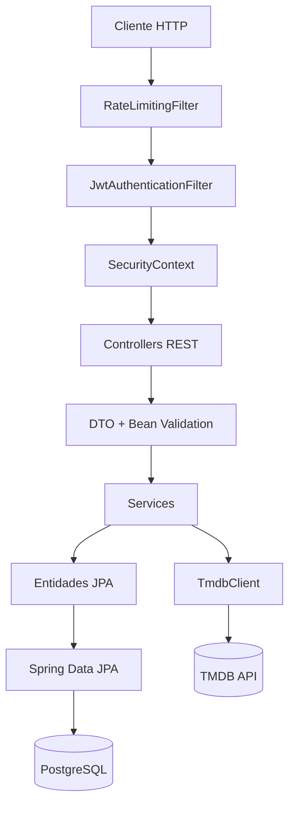
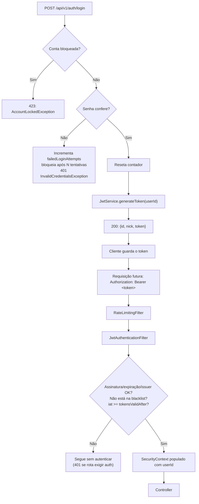
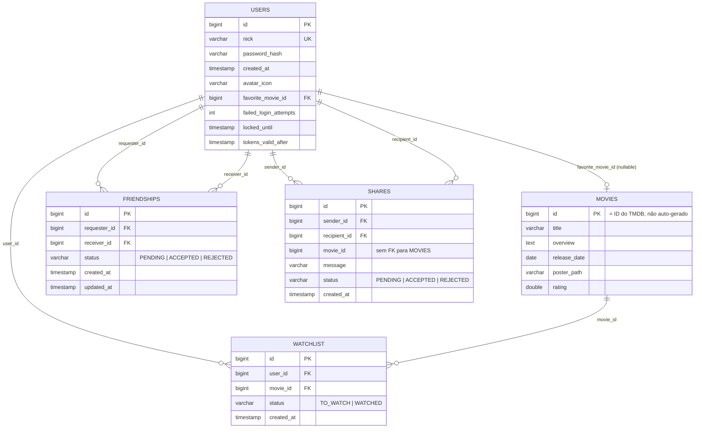

# Arquitetura e Documentação Técnica do WatchuSee Backend

Este documento descreve a arquitetura, as regras de negócio e as decisões técnicas do backend do WatchuSee — uma API REST em Spring Boot que combina descoberta de filmes (via TMDB), watchlist pessoal, amizades e compartilhamento de recomendações, com autenticação própria via JWT.

O objetivo é servir como referência técnica precisa: cada afirmação aqui foi verificada contra o código-fonte atual. Onde o comportamento real diverge do que seria "o ideal", isso é sinalizado explicitamente em vez de omitido — inclusive na seção [Débito técnico e bugs conhecidos](#débito-técnico-e-bugs-conhecidos), que consolida tudo que precisa de atenção antes de produção com carga real.

## Índice

* [Visão geral da arquitetura](#visão-geral-da-arquitetura)
* [Usuários](#usuários)
* [Filmes](#filmes)
* [Watchlist](#watchlist)
* [Amigos](#amigos)
* [Compartilhamento (Shares)](#compartilhamento-shares)
* [Autenticação e segurança](#autenticação-e-segurança)
* [Banco de dados](#banco-de-dados)
* [Integração externa com TMDB](#integração-externa-com-tmdb)
* [API / Endpoints](#api--endpoints)
* [Tratamento de erros](#tratamento-de-erros)
* [Validações](#validações)
* [Serviços (Services)](#serviços-services)
* [Repositories](#repositories)
* [Dependências (`pom.xml`)](#dependências-pomxml)
* [Configuração](#configuração)
* [Como executar](#como-executar)
* [Testes](#testes)
* [Swagger / OpenAPI](#swagger--openapi)
* [Decisões arquiteturais](#decisões-arquiteturais)
* [Débito técnico e bugs conhecidos](#débito-técnico-e-bugs-conhecidos)
* [Melhorias futuras](#melhorias-futuras)
* [Tecnologias utilizadas](#tecnologias-utilizadas)
* [Autor](#autor)

---

## Visão geral da arquitetura

Layered architecture organizada por **package-by-feature**: cada módulo de negócio (`user`, `movie`, `watchlist`, `friend`, `share`) carrega sua própria pilha completa — `domain` (entidade JPA), `repository`, `service`, controller e DTOs — em vez de pacotes horizontais (`controllers/`, `services/`, `repositories/`). O módulo `shared` concentra o que atravessa todos os outros: segurança (JWT, rate limiting) e o tratamento global de erros.

<details>
<summary>Ver arquitetura</summary>



</details>

Ponto de atenção sobre a organização por feature: como cada módulo injeta diretamente repositories/services de outros módulos (`WatchlistService` conhece `MovieRepository`/`MovieService`; `UserService` e `UserProfileService` conhecem `FriendshipRepository`/`WatchlistRepository`), o isolamento é só de pacote, não de acoplamento — não há uma camada de fachada entre módulos. Isso é aceitável na escala atual do projeto, mas é o primeiro lugar a rever se o número de módulos crescer.

Dentro de cada módulo, a nomenclatura dos pacotes internos **não é consistente**: `user`, `friend` e `share` colocam controllers em `<módulo>/controller/`, enquanto `movie` e `watchlist` colocam os controllers direto em `<módulo>/api/`. Da mesma forma, `movie` mantém DTOs tanto em `movie/dto/` quanto em `movie/api/dto/`, sem um critério claro de quando um DTO vai para qual pasta. Ver [Débito técnico](#débito-técnico-e-bugs-conhecidos).

---

## Usuários

### Entidade `User`

```java
@Entity @Table(name = "users")
class User {
    Long id;                       // PK, identity
    String nick;                   // unique, not null, length 30
    String passwordHash;           // not null (hash via PasswordEncoder)
    Instant createdAt;             // not null, imutável
    AvatarIcon avatarIcon;         // enum, nullable
    Movie favoriteMovie;           // @ManyToOne LAZY, nullable
    int failedLoginAttempts;       // not null, default 0 (DEFAULT 0 no schema)
    Instant lockedUntil;           // nullable — bloqueio temporário de conta
    Instant tokensValidAfter;      // nullable — invalida JWTs emitidos antes deste instante
}
```

Comportamento relevante (métodos de domínio, não getters/setters anêmicos):
- `registerFailedLoginAttempt(maxAttempts, lockDuration, now)`: incrementa o contador e bloqueia a conta (`lockedUntil`) ao atingir o limite.
- `resetFailedLoginAttempts()`: chamado após login bem-sucedido.
- `isLocked(now)`: usado pelo `AuthService` antes de sequer conferir a senha.
- `invalidateTokensIssuedBefore(instant)`: chamado ao trocar a senha — todo JWT com `iat` anterior a esse instante passa a ser rejeitado pelo `JwtAuthenticationFilter`, mesmo que ainda não tenha expirado.
- `updateAvatarIcon` / `updateFavoriteMovie` / `removeFavoriteMovie`: lançam `IllegalArgumentException` se receberem `null`.

### Enum `AvatarIcon`

`POPCORN, CLAPPERBOARD, FILM_REEL, TICKET, DIRECTOR_CHAIR, STAR, COMEDY_MASK, TRAGEDY_MASK, GHOST, ROBOT, ALIEN, ASTRONAUT`.

---

## Filmes

`Movie` é uma entidade JPA minimalista, usada **apenas como referência local** para o que já foi adicionado à watchlist ou marcado como favorito — não é o catálogo completo do TMDB:

```java
@Entity @Table(name = "movies")
class Movie {
    Long id;                // = ID do filme no TMDB
    String title;           // not null, length 255
    String overview;        // TEXT
    LocalDate releaseDate;
    String posterPath;      // length 500
    Double rating;
}
```

O `id` **não** usa `@GeneratedValue`, sendo ele o próprio ID do TMDB — isso garante que a mesma entidade nunca seja duplicada localmente para o mesmo filme.

Toda consulta de filme "ao vivo" (busca, tendências, populares, similares, avaliações etc.) vai direto ao TMDB via `MovieService` → `TmdbClient` → `TmdbClientImpl` (usando `RestClient`) e **não** passa pelo `MovieRepository`. O `MovieRepository` só é usado para persistir localmente um filme na primeira vez que ele entra na watchlist ou vira favorito de alguém (`findOrCreateMovie`, implementado de forma quase idêntica em `WatchlistService` e `UserService` — ver [Débito técnico](#débito-técnico-e-bugs-conhecidos)).

---

## Watchlist

### Entidade `Watchlist`

```java
@Entity @Table(name = "watchlist", uniqueConstraints = @UniqueConstraint(columnNames = {"user_id", "movie_id"}))
class Watchlist {
    Long id;
    User user;
    Movie movie;
    WatchlistStatus status;
    Instant createdAt;
}
```

A constraint única `(user_id, movie_id)` garante no banco que um usuário não pode ter duas entradas para o mesmo filme — daí `updateStatus` funcionar como "criar-ou-atualizar" (upsert manual em `WatchlistService`).

### Endpoints

| Método | Endpoint | Auth | Descrição |
|---|---|---|---|
| `GET` | `/api/v1/watchlist` | 🔒 | Lista a watchlist do usuário autenticado. Query params: `status` (opcional, `TO_WATCH`/`WATCHED`), `page` (padrão `0`), `size` (padrão `20`, máx. `100`). Ordenado por `createdAt` desc. |
| `GET` | `/api/v1/watchlist/{movieId}` | 🔒 | Consulta um filme específico na própria watchlist. |
| `PUT` | `/api/v1/watchlist/{movieId}` | 🔒 | Cria ou atualiza o status do filme (`{"status": "TO_WATCH"}` ou `"WATCHED"`). |
| `DELETE` | `/api/v1/watchlist/{movieId}` | 🔒 | Remove o filme da watchlist. |
| `GET` | `/api/v1/users/{userId}/watchlist` | 🔒 | Watchlist **de outro usuário**. Não exige amizade, apenas autenticação. |

---

## Amigos

### Entidade `Friendship`

```java
@Entity @Table(name = "friendships", uniqueConstraints = @UniqueConstraint(columnNames = {"requester_id", "receiver_id"}))
class Friendship {
    Long id;
    User requester;
    User receiver; 
    FriendshipStatus status; 
    Instant createdAt;
    Instant updatedAt;
}
```

### Endpoints

| Método | Endpoint | Descrição |
|---|---|---|
| `POST` | `/api/v1/friends/requests/{userId}` | Envia solicitação de amizade. 204 em sucesso; 409 se já existe pedido entre os dois em qualquer status (ver [Débito técnico](#débito-técnico-e-bugs-conhecidos)); 400 se `userId` inválido ou for o próprio usuário. |
| `GET` | `/api/v1/friends/requests` | Lista solicitações **recebidas** e pendentes. |
| `POST` | `/api/v1/friends/requests/{requestId}/accept` | Aceita uma solicitação recebida (só o destinatário pode). |
| `POST` | `/api/v1/friends/requests/{requestId}/reject` | Recusa uma solicitação recebida. |
| `GET` | `/api/v1/friends` | Lista amigos (relações `ACCEPTED`, em qualquer direção). |
| `GET` | `/api/v1/friends/count` | Conta amigos. |
| `GET` | `/api/v1/friends/status/{userId}` | Retorna o relacionamento com outro usuário: `SELF`, `NONE`, `FRIENDS`, `REQUEST_SENT`, `REQUEST_RECEIVED` ou `REJECTED`. |

Todos exigem autenticação. Não há regra explícita no `SecurityConfig` para `/api/v1/friends/**`, então essas rotas caem na regra padrão `anyRequest().authenticated()`.

---

## Compartilhamento (Shares)

### Entidade `Share`

```java
@Entity @Table(name = "shares", indexes = {idx_share_recipient, idx_share_sender, idx_share_status})
class Share {
    Long id;
    User sender;
    User recipient;  
    Long movieId;    
    String message; 
    ShareStatus status;  
    Instant createdAt;
}
```

`Share.movieId` é um `Long` solto, não uma relação JPA para `Movie` — diferente de `Watchlist.movie`, que é `@ManyToOne`. Isso significa que um `Share` pode referenciar um `movieId` que nunca foi persistido localmente como `Movie` (comportamento esperado, já que `ShareService` nunca consulta `MovieRepository`/`MovieService`).

### Endpoints

| Método | Endpoint | Descrição |
|---|---|---|
| `POST` | `/api/v1/shares` | Compartilha um filme com outro usuário, por `recipientNick`. 400 se já existe um share `PENDING` idêntico (via `IllegalArgumentException`); 404 se o nick não existe (`ShareRecipientNotFoundException`). |
| `GET` | `/api/v1/shares/received` | Todos os shares recebidos (qualquer status). |
| `GET` | `/api/v1/shares/pending` | Apenas os `PENDING` recebidos. |
| `GET` | `/api/v1/shares/sent` | Todos os enviados. |
| `PATCH` | `/api/v1/shares/{shareId}/accept` | Aceita (apenas o destinatário; só se `PENDING`). |
| `PATCH` | `/api/v1/shares/{shareId}/reject` | Recusa (mesma regra). |

---

## Autenticação e segurança

### Visão geral do fluxo

<details>
<summary>Visão geral do fluxo</summary>


</details>

### Componentes de autenticação e sessão

- **`SecurityConfig`**: `@EnableWebSecurity`, CSRF desabilitado (justificado: API stateless, autenticação via header e não via cookie), sessão `STATELESS`, cabeçalhos de segurança (`X-Frame-Options: DENY`, `X-Content-Type-Options: nosniff`, `Referrer-Policy: strict-origin-when-cross-origin`, `HSTS`). Cadeia de filtros: `RateLimitingFilter` → `JwtAuthenticationFilter` → resto da cadeia padrão do Spring Security.
- **`JwtService`**: usa `io.jsonwebtoken` (JJWT 0.12.6). Gera tokens com `jti` (UUID), `issuer` (`security.jwt.issuer`), `issuedAt`, `notBefore` e `expiration` (`security.jwt.expiration-ms`, padrão 24h). Assinatura HMAC (`Keys.hmacShaKeyFor`) a partir de `security.jwt.secret`, que precisa ter ao menos 32 caracteres (validado no construtor, lançando exceção no boot se for menor). `isValid()` também consulta `TokenBlacklistService.isRevoked(jti)`.
- **`TokenBlacklistService`** (interface) / **`InMemoryTokenBlacklistService`**: usada por `POST /auth/logout` para revogar um token antes de sua expiração natural. **Em memória, por instância** — não sobrevive a reinício e não é compartilhada entre réplicas.
- **`TokenValidityService`** (interface) / **`UserTokenValidityService`**: verifica, a cada requisição autenticada, se o `issuedAt` do token é anterior ao `tokensValidAfter` do usuário (setado ao trocar a senha). Isso implica **uma consulta ao banco por requisição autenticada** — custo de performance aceito conscientemente em troca de poder invalidar sessões antigas ao trocar senha.
- **`JwtAuthenticationFilter`**: extrai o header `Authorization`, valida o token, checa a blacklist e o `tokensValidAfter`, e só então popula o `SecurityContextHolder`. Falhas não lançam exceção HTTP diretamente — o filtro apenas deixa de autenticar, e a decisão de bloquear (401/403) fica a cargo de `authorizeHttpRequests` mais adiante na cadeia.
- **`AuthenticatedUser`**: helper usado por todos os controllers para obter o `userId` do usuário logado a partir do `SecurityContextHolder` — lança `IllegalStateException` se não houver autenticação, o que é capturado como **409** pelo `GlobalExceptionHandler` (status semanticamente incorreto para esse caso; ver [Débito técnico](#débito-técnico-e-bugs-conhecidos)).
- **`PasswordEncoderConfig`**: `PasswordEncoderFactories.createDelegatingPasswordEncoder()` — delega para BCrypt por padrão, com suporte a múltiplos algoritmos via prefixo (`{bcrypt}`, `{noop}` etc.) já embutido no hash salvo, o que permite migrar de algoritmo sem reescrever senhas existentes manualmente.
- **`RateLimitingFilter`**: sliding-window simples em memória, por IP (via `X-Forwarded-For` ou `getRemoteAddr()`), aplicado a `/auth/login`, `POST /users`, `PUT /users/me/password` (bucket "auth", padrão 10 req/min) e `GET /movies/**` (bucket "public-api", padrão 60 req/min). Retorna `429` com header `Retry-After`. Limitação assumida: por IP e em memória — contornável com múltiplos IPs, e não compartilhado entre réplicas.
- **Bloqueio de conta**: `AuthService` bloqueia a conta por `security.login.lock-duration-minutes` (padrão 15 min) após `security.login.max-attempts` (padrão 5) tentativas de login inválidas seguidas.
- **Mitigação de enumeração de usuários**: ao tentar logar com um nick inexistente, `AuthService` executa `passwordEncoder.matches()` contra um hash fixo (`security.login.dummy-password-hash`, via `DUMMY_PASSWORD_HASH`) só para igualar o tempo de resposta ao caso de "senha incorreta" — evita que um atacante descubra nicks existentes medindo latência.

### Autorização — como o sistema impede acesso a dados de outros usuários

Não há um mecanismo de autorização declarativo (nenhum `@PreAuthorize`) — a checagem é feita **manualmente, dentro de cada service**, comparando o `userId` autenticado com o dono do recurso:

- `ShareService.acceptShare/rejectShare`: usa `shareRepository.findByIdAndRecipientId(shareId, userId)` — se o share não pertence ao usuário, o `findBy` simplesmente não encontra nada, retornando 404, não 403.
- `FriendService.acceptRequest/rejectRequest`: busca por ID e depois compara `friendship.getReceiver().getId().equals(userId)` manualmente, lançando `IllegalStateException` (→ 409) se não bater — semanticamente deveria ser 403.
- `WatchlistController`/`UserWatchlistController`: o `userId` da própria watchlist vem sempre de `AuthenticatedUser.getId()`, nunca de parâmetro do cliente — mas a watchlist de **outro** usuário é intencionalmente pública para qualquer autenticado (não há checagem de amizade).

### Endpoints públicos vs. protegidos

Definidos explicitamente em `SecurityConfig` (o resto cai em `anyRequest().authenticated()`):

- **Públicos**: `POST /api/v1/auth/login`, `POST /api/v1/users` (cadastro), `GET /api/v1/movies/**`, `/swagger-ui/**`, `/v3/api-docs/**`, `/actuator/health`.
- **Explicitamente autenticados** (redundante com o `anyRequest()`, mas declarado por clareza): `POST /api/v1/auth/logout`, `GET /api/v1/users/search`, `GET /api/v1/users/*/profile`, `PUT /api/v1/users/me/password`, todos os métodos de `/api/v1/watchlist/**`.
- **Autenticados por recair no `anyRequest()`** (sem regra própria, mas exigem login na prática): `/api/v1/friends/**`, `/api/v1/shares/**`, `/api/v1/users/{userId}/watchlist`, `/api/v1/users/avatar-icons`, `/api/v1/users/me/avatar`, `/api/v1/users/me/favorite-movie`.

### CORS

Configurado diretamente em `SecurityConfig`, via `CorsConfigurationSource`:

```java
private CorsConfigurationSource corsConfigurationSource() {
    CorsConfiguration configuration = new CorsConfiguration();
    configuration.setAllowedOrigins(allowedOrigins); // security.cors.allowed-origins
    configuration.setAllowedMethods(List.of("GET", "POST", "PUT", "PATCH", "DELETE", "OPTIONS"));
    configuration.setAllowedHeaders(List.of("Authorization", "Content-Type", "Accept"));
    configuration.setExposedHeaders(List.of("Retry-After"));
    configuration.setAllowCredentials(false);
    configuration.setMaxAge(3600L);

    UrlBasedCorsConfigurationSource source = new UrlBasedCorsConfigurationSource();
    source.registerCorsConfiguration("/**", configuration);
    return source;
}
```

`allowedOrigins` vem de `@Value("${security.cors.allowed-origins:http://localhost:3000,http://localhost:5173}")` — uma lista separada por vírgulas, configurável via `application.properties` sem precisar de uma classe de propriedades dedicada. Não há credenciais (cookies) habilitadas via CORS, o que é coerente com autenticação via header `Authorization`. Em produção, recomenda-se restringir `security.cors.allowed-origins` apenas ao domínio real do frontend.

### Mitigação de SSRF na integração com o TMDB

Como a aplicação faz chamadas HTTP para um host externo configurável (TMDB), há três camadas de defesa contra SSRF, todas implementadas em `config/`:

**1. Whitelist de hosts (`TmdbProperties` + `IpAllowlistConfig`)**

```java
@Validated
@ConfigurationProperties(prefix = "tmdb")
public record TmdbProperties(
        @NotBlank String baseUrl,
        @NotBlank String apiKey,
        @NotBlank String language,
        Duration connectTimeout,
        Duration readTimeout,
        @Min(0) int maxRetries,
        Duration retryInitialDelay,
        Duration retryMaxDelay,
        Set<String> allowedHosts
) {}
```

`IpAllowlistConfig` extrai o host de cada URL de requisição (`java.net.URI`) e compara, case-insensitive, contra `tmdb.allowed-hosts`. Se a lista vier vazia, o bean falha no startup (`IllegalStateException`) — a aplicação não sobe com allowlist desabilitada por omissão.

**2. Bloqueio no interceptor do `RestClient` (`RestClientConfig`)**

A checagem de allowlist acontece a **cada tentativa de requisição**, dentro do mesmo `requestInterceptor` que implementa o retry:

```java
private ClientHttpResponse executeWithAllowlistCheckAndRetry(...) throws IOException {
    int attempt = 0;
    while (true) {
        String host = IpAllowlistConfig.extractHostFromUrl(request.getURI().toString());
        if (!allowlistConfig.isAllowed(host)) {
            throw new SecurityException("SSRF Mitigation: Access denied to host: " + host);
        }
    }
}
```

O backoff é exponencial (`initialDelay * 2^tentativa`, limitado a `retryMaxDelay`), e a lista de status retryable é `429` e qualquer `5xx`.

**3. Validação de certificado TLS (`CustomSSLContext`)**

```java
private static final Set<String> BLOCKED_HOSTPATTERNS =
        Set.of("localhost", "127.0.0.1", "::1");

private static class SecureTrustManager implements X509TrustManager {
    @Override
    public void checkServerTrusted(X509Certificate[] certs, String authType) throws CertificateException {
        for (X509Certificate cert : certs) {
            if (!isTrustedByPublicCA(cert)) {
                throw new CertificateException("SSRF: Auto-signed certificate rejected!");
            }
        }
    }
}
```

Certificados autoassinados são rejeitados mesmo que o host esteja na allowlist — proteção adicional contra um MITM que tentasse se passar pelo TMDB.

**Débito nessa área** (detalhado também em [Débito técnico](#débito-técnico-e-bugs-conhecidos)): `tmdb.connect-timeout` e `tmdb.read-timeout` existem em `TmdbProperties` e em `application.properties`, mas **não são aplicados em lugar nenhum** — o `JdkClientHttpRequestFactory` criado por `CustomSSLContext.createSecureRequestFactory()` não recebe esses valores. Na prática, o `RestClient` do TMDB usa os timeouts padrão da JDK (sem limite superior configurado explicitamente).

---

## Banco de dados

- **SGBD**: PostgreSQL (hospedado no Supabase, conforme `application.properties`).
- **Driver**: `org.postgresql.Driver` (dependência `postgresql`, `scope=runtime`).
- **ORM**: Spring Data JPA + Hibernate, dialect `PostgreSQLDialect`, schema padrão `app` (`hibernate.default_schema=app`).
- **Gerência de schema**: `spring.jpa.hibernate.ddl-auto=update` — Hibernate altera as tabelas automaticamente a cada boot, comparando as entidades com o schema existente. **Não há Flyway/Liquibase** neste projeto (nenhuma dependência, nenhuma pasta de migrations).
- **`open-in-view=false`**: desabilitado explicitamente — cada `@Transactional` deve carregar tudo que precisa antes de a sessão do Hibernate fechar; não há *lazy loading* implícito na camada web.

<details>


</details>

Constraints únicas relevantes: `(user_id, movie_id)` em `watchlist`; `(requester_id, receiver_id)` em `friendships`. Índices explícitos em `shares`: `recipient_id`, `sender_id`, `status`.

Caminho de uma requisição até o banco (exemplo genérico):
```text
HTTP → Controller (valida DTO) → Service (regra de negócio) → Repository (Spring Data JPA)
     → Hibernate (gera SQL) → HikariCP (pool de conexões) → PostgreSQL (Supabase)
```

---

## Integração externa com TMDB

Único serviço externo integrado. Configuração via `@ConfigurationProperties(prefix = "tmdb")` (`TmdbProperties`) e um `RestClient` (`RestClientConfig`) com `baseUrl` fixo, allowlist de host e retry com backoff exponencial (detalhes em [Mitigação de SSRF](#mitigação-de-ssrf-na-integração-com-o-tmdb)).

`TmdbClientImpl` implementa `TmdbClient` chamando os seguintes endpoints do TMDB v3 (autenticação via `api_key` como query param, não header):

| Método da interface | Endpoint TMDB |
|---|---|
| `searchMovies` | `GET /3/search/movie` |
| `getMovie` | `GET /3/movie/{id}` |
| `getTrendingMovies` | `GET /3/trending/movie/week` |
| `getTopRatedMovies` | `GET /3/movie/top_rated` |
| `getPopularMovies` | `GET /3/movie/popular` |
| `getNowPlayingMovies` | `GET /3/movie/now_playing` |
| `getUpcomingMovies` | `GET /3/movie/upcoming` |
| `getSimilarMovies` | `GET /3/movie/{id}/similar` |
| `getMovieRecommendations` | `GET /3/movie/{id}/recommendations` |
| `getMovieReviews` | `GET /3/movie/{id}/reviews` |
| `getMovieLists` | `GET /3/movie/{id}/lists` |
| `getMovieVideos` | `GET /3/movie/{id}/videos` |

Tratamento de erro: qualquer `RestClientException` genérica vira `TmdbException` (mapeada para `502 Bad Gateway`); um 404 específico em `getMovie` vira `TmdbMovieNotFoundException` (mapeada para `404`).

**Bugs encontrados na integração:**
- `getUpcomingMovies(int page)` **não envia o parâmetro `page` na requisição ao TMDB** (o `.queryParam("page", page)` está ausente nesse método específico, presente em todos os outros). Na prática, `GET /api/v1/movies/upcoming?page=2` sempre retorna a página 1 do TMDB.
- `getMovieVideos` usa `"pt-BR"` fixo como idioma, em vez de `tmdbProperties.language()` como todos os outros métodos — inofensivo enquanto a configuração for `pt-BR`, mas quebra a consistência se o idioma for alterado.

---

## API / Endpoints

Prefixo comum: `/api/v1`. 🔒 = requer `Authorization: Bearer <token>`.

### Autenticação
| Método | Endpoint | Descrição |
|---|---|---|
| POST | `/auth/login` | Login, retorna `{id, nick, token}`. |
| POST | `/auth/logout` 🔒 | Revoga o token atual. |

### Usuários
| Método | Endpoint | Descrição |
|---|---|---|
| POST | `/users` | Cadastro. |
| GET | `/users/search?query=` 🔒 | Busca por nick (máx. 20 resultados, exclui o próprio usuário). |
| PUT | `/users/me/password` 🔒 | Troca de senha (invalida sessões antigas). |
| GET | `/users/avatar-icons` 🔒 | Lista os ícones de avatar disponíveis. |
| PUT | `/users/me/avatar` 🔒 | Define o ícone de avatar. |
| PUT | `/users/me/favorite-movie` 🔒 | Define o filme favorito (busca/persiste do TMDB se necessário). |
| DELETE | `/users/me/favorite-movie` 🔒 | Remove o filme favorito. |
| GET | `/users/me/profile` 🔒 | Perfil do usuário autenticado. |
| GET | `/users/{userId}/profile` 🔒 | Perfil público de outro usuário. |

### Filmes (todos públicos)
| Método | Endpoint | Parâmetros |
|---|---|---|
| GET | `/movies/search` | `query` (2–100 chars) |
| GET | `/movies/{movieId}` | — |
| GET | `/movies/{movieId}/trailer` | 204 se não houver trailer |
| GET | `/movies/{movieId}/similar` | `page` (1–1000) |
| GET | `/movies/{movieId}/recommendations` | `page` |
| GET | `/movies/{movieId}/reviews` | `page` |
| GET | `/movies/{movieId}/lists` | `page` |
| GET | `/movies/trending/week` | — |
| GET | `/movies/trending/random` | — |
| GET | `/movies/popular` | `page` |
| GET | `/movies/now-playing` | `page` |
| GET | `/movies/upcoming` | `page` (ignorado pelo client, ver bug acima) |
| GET | `/movies/top-rated` | `page` |

### Watchlist
| Método | Endpoint |
|---|---|
| GET 🔒 | `/watchlist?status=&page=&size=` |
| GET 🔒 | `/watchlist/{movieId}` |
| PUT 🔒 | `/watchlist/{movieId}` |
| DELETE 🔒 | `/watchlist/{movieId}` |
| GET 🔒 | `/users/{userId}/watchlist?status=&page=&size=` |

### Amigos
| Método | Endpoint |
|---|---|
| POST 🔒 | `/friends/requests/{userId}` |
| GET 🔒 | `/friends/requests` |
| POST 🔒 | `/friends/requests/{requestId}/accept` |
| POST 🔒 | `/friends/requests/{requestId}/reject` |
| GET 🔒 | `/friends` |
| GET 🔒 | `/friends/count` |
| GET 🔒 | `/friends/status/{userId}` |

### Compartilhamentos
| Método | Endpoint |
|---|---|
| POST 🔒 | `/shares` |
| GET 🔒 | `/shares/received` |
| GET 🔒 | `/shares/pending` |
| GET 🔒 | `/shares/sent` |
| PATCH 🔒 | `/shares/{shareId}/accept` |
| PATCH 🔒 | `/shares/{shareId}/reject` |

---

## Tratamento de erros

`GlobalExceptionHandler` (`@RestControllerAdvice`) centraliza todas as respostas de erro em um `ErrorResponse` padrão:

```json
{ "timestamp": "...", "status": 401, "error": "Unauthorized", "message": "Nick ou senha inválidos.", "path": "/api/v1/auth/login" }
```

| Exceção | Status | Observação |
|---|---|---|
| `ConstraintViolationException`, `MethodArgumentNotValidException` | 400 | Validação de `@RequestParam`/`@PathVariable`/`@Valid`. |
| `UserAlreadyExistsException` | 409 | Nick já cadastrado. |
| `UserNotFoundException` | 404 | |
| `InvalidCredentialsException` | 401 | Login ou troca de senha. |
| `AccountLockedException` | 423 (`LOCKED`) | Conta bloqueada por tentativas inválidas. |
| `TmdbMovieNotFoundException` | 404 | |
| `TmdbException` | 502 | Falha genérica ao chamar o TMDB. |
| `IllegalArgumentException` | 400 | Usada de forma ampla em quase todos os services para regras de validação de negócio (não só argumentos inválidos). |
| `IllegalStateException` | 409 | Usada tanto para "operação não permitida" (`AuthenticatedUser` sem contexto, `FriendService`/`ShareService` recusando ação de quem não é dono) quanto para "estado inválido" (solicitação já processada) — status HTTP semanticamente incorreto para os casos de autorização (ver [Débito técnico](#débito-técnico-e-bugs-conhecidos)). |
| `AccessDeniedException` | 403 | Handler presente, mas nenhuma parte do código lança essa exceção do Spring Security diretamente (não há `@PreAuthorize`). |
| `ShareRecipientNotFoundException` | 404 | |
| `WatchlistItemNotFoundException` | 404 | **Handler existe, mas a exceção nunca é lançada** — "filme não encontrado na watchlist" hoje é sinalizado como `IllegalArgumentException` (400), não 404. |
| `HttpMessageNotReadableException`, `MissingServletRequestParameterException`, `MethodArgumentTypeMismatchException` | 400 | JSON malformado, parâmetro obrigatório ausente, tipo incompatível. |
| Qualquer outra `Exception` | 500 | Handler catch-all: loga a exceção completa no servidor, responde com mensagem genérica — nunca expõe stacktrace ao cliente. |

---

## Validações

Bean Validation (`jakarta.validation`) usado consistentemente nos DTOs de entrada e em `@PathVariable`/`@RequestParam` (com `@Validated` na classe do controller):

- `CreateUserRequest`: `nick` — `@NotBlank`, `@Size(3,30)`, `@Pattern("^[a-zA-Z0-9_.]+$")`; `password` — `@NotBlank`, `@Size(6,100)`, `@Pattern` exigindo ao menos uma letra e um número.
- `ChangePasswordRequest`: `currentPassword` — `@Size(6,100)`; `newPassword` — `@Size(8,100)` + mesmo `@Pattern` de complexidade.
- `LoginRequest`: mesmas regras de tamanho de `nick`/`password` do cadastro (sem o `@Pattern`, já que precisa aceitar nicks de usuários já existentes).
- `CreateShareRequest`: `movieId` `@NotNull @Positive`; `recipientNick` `@NotBlank @Size(3,30)`; `message` `@Size(max=500)` (opcional).
- `UpdateWatchlistRequest`: `status` `@NotNull`.
- `UpdateFavoriteMovieRequest`: `movieId` `@NotNull @Positive`.
- Todos os `movieId`/`userId`/`shareId`/`requestId` em `@PathVariable` têm `@Positive`.
- Paginação (`page`, `size` em watchlist; `page` em filmes): `@Min`/`@Max`.

As mensagens de validação (`message = "..."`) são customizadas e em português, retornadas diretamente no campo `message` do `ErrorResponse`.

---

## Serviços (Services)

| Service | Responsabilidade | Depende de |
|---|---|---|
| `AuthService` | Login: valida bloqueio de conta, credenciais (com mitigação de timing attack), incrementa/reseta contador de falhas, emite JWT. | `UserRepository`, `PasswordEncoder`, `JwtService` |
| `UserService` | Cadastro, troca de senha (com invalidação de sessões), busca de usuários, avatar, filme favorito. | `UserRepository`, `PasswordEncoder`, `MovieRepository`, `MovieService` |
| `UserProfileService` | Monta o DTO de perfil (contadores de watchlist e amigos), usado tanto para o perfil próprio quanto o público. | `UserRepository`, `WatchlistRepository`, `FriendshipRepository` |
| `MovieService` | Toda consulta "ao vivo" ao TMDB, tradução de DTOs externos para domínio/DTOs de resposta. | `TmdbClient`, `MovieMapper` |
| `WatchlistService` | CRUD da watchlist, incluindo a criação lazy do `Movie` local. | `WatchlistRepository`, `UserRepository`, `MovieRepository`, `MovieService` |
| `FriendService` | Ciclo de vida de solicitações de amizade, listagem, contagem, status de relacionamento. | `FriendshipRepository`, `UserRepository` |
| `ShareService` | Ciclo de vida de compartilhamentos de filme. | `ShareRepository`, `UserRepository` |

Todos os métodos que alteram estado são `@Transactional`; leituras usam `@Transactional(readOnly = true)`.

---

## Repositories

| Repository | Métodos customizados | Interpretação |
|---|---|---|
| `UserRepository` | `findByNick`, `existsByNick`, `findTop20ByNickContainingIgnoreCaseOrderByNickAsc` | O último é uma query derivada composta: `LIKE %nick%` case-insensitive, ordenada, limitada a 20 (`Top20`). |
| `MovieRepository` | Nenhum customizado, só o CRUD padrão do `JpaRepository`. | |
| `WatchlistRepository` | `findByUserIdAndMovieId`, `findAllByUserId`, `findAllByUserIdAndStatus` (todos com `@EntityGraph(attributePaths = "movie")` para evitar N+1 ao serializar o filme), `existsByUserIdAndMovieIdAndStatus`, `countByUserIdAndStatus`, `deleteByUserIdAndMovieId`. | |
| `FriendshipRepository` | `findByRequesterIdAndReceiverId`, `existsByRequesterIdAndReceiverId`, `countByRequesterIdAndStatus`, `countByReceiverIdAndStatus`, `findByReceiverIdAndStatus`, `findByRequesterIdAndStatus`, `findByRequesterIdOrReceiverIdAndStatus`. | |
| `ShareRepository` | `findByRecipientIdOrderByCreatedAtDesc`, `findBySenderIdOrderByCreatedAtDesc`, `findByRecipientIdAndStatusOrderByCreatedAtDesc`, `findByIdAndRecipientId`, `findByIdAndSenderId` (não usado em nenhum service — ver [Débito técnico](#débito-técnico-e-bugs-conhecidos)), `existsBySenderIdAndRecipientIdAndMovieIdAndStatus`. | |

---

## Dependências (`pom.xml`)

| Dependência | Finalidade |
|---|---|
| `spring-boot-starter-webmvc` | Roteamento REST (MVC). |
| `spring-boot-starter-data-jpa` | Spring Data JPA / Hibernate. |
| `spring-boot-starter-security` + `spring-security-crypto` | Autenticação/autorização e `PasswordEncoder`. |
| `spring-boot-starter-validation` | Bean Validation (Jakarta). |
| `spring-boot-starter-actuator` | Endpoint `/actuator/health` (único exposto publicamente). |
| `spring-boot-starter-cache` | Infraestrutura de cache do Spring (`@Cacheable`/`@CacheEvict`) — dependência presente, mas nenhum cache é usado hoje (ver [Melhorias futuras](#melhorias-futuras)). |
| `springdoc-openapi-starter-webmvc-ui` (3.0.2) | Geração de OpenAPI/Swagger UI. |
| `postgresql` (runtime) | Driver JDBC do PostgreSQL. |
| `io.jsonwebtoken:jjwt-api/jjwt-impl/jjwt-jackson` (0.12.6) | Geração e validação de JWT. |
| `spring-boot-devtools` (runtime, optional) | Live reload em desenvolvimento. |
| `com.squareup.okhttp3:mockwebserver` (teste) | Simulação de servidor HTTP para testar `TmdbClientImpl`. |
| `h2` (teste) | Banco em memória para testes com persistência real. |
| `spring-boot-starter-*-test` (actuator, cache, validation, webmvc) | Suporte de teste correspondente a cada starter. |

Dependências transitivas relevantes (não declaradas diretamente, mas trazidas pelos starters): **Hibernate ORM** (persistência), **HikariCP** (pool de conexões, padrão do Spring Boot), **Jackson** (serialização JSON).

Parent: `spring-boot-starter-parent` **4.1.1**. Java `21`. Build: Maven (`spring-boot-maven-plugin`).

---

## Configuração

Arquivo único: `src/main/resources/application.properties`

```properties
spring.application.name=watchusee

tmdb.base-url=https://api.themoviedb.org
tmdb.api-key=${TMDB_API_KEY}
tmdb.language=pt-BR

tmdb.connect-timeout=${TMDB_CONNECT_TIMEOUT:3s}
tmdb.read-timeout=${TMDB_READ_TIMEOUT:5s}

tmdb.max-retries=${TMDB_MAX_RETRIES:3}
tmdb.retry-initial-delay=${TMDB_RETRY_INITIAL_DELAY:500ms}
tmdb.retry-max-delay=${TMDB_RETRY_MAX_DELAY:5s}

tmdb.allowed-hosts=localhost,127.0.0.1,::1,api.themoviedb.org

security.jwt.issuer=watchusee-api
security.jwt.secret=${JWT_SECRET}
security.jwt.expiration-ms=86400000

security.login.max-attempts=5
security.login.lock-duration-minutes=15

security.rate-limit.enabled=true
security.rate-limit.auth.max-requests=10
security.rate-limit.auth.window-seconds=60
security.rate-limit.public-api.max-requests=60
security.rate-limit.public-api.window-seconds=60

security.rate-limit.friend-request.max-requests=${FRIEND_REQUEST_RATE_LIMIT_MAX:20}
security.rate-limit.friend-request.window-seconds=${FRIEND_REQUEST_RATE_LIMIT_WINDOW_SECONDS:60}

security.cors.allowed-origins=http://localhost:3000,http://localhost:5173

spring.datasource.url=${SUPABASE_URL}
spring.datasource.username=${SUPABASE_USERNAME}
spring.datasource.password=${SUPABASE_PASSWORD}
spring.datasource.driver-class-name=org.postgresql.Driver

spring.jpa.hibernate.ddl-auto=update
spring.jpa.open-in-view=false
spring.jpa.properties.hibernate.default_schema=app
spring.jpa.properties.hibernate.dialect=org.hibernate.dialect.PostgreSQLDialect

management.endpoints.web.exposure.include=health
management.endpoint.health.show-details=never

security.login.dummy-password-hash=${DUMMY_PASSWORD_HASH}
```

### Variáveis de ambiente

| Variável | Obrigatória | Descrição |
|---|---|---|
| `TMDB_API_KEY` | Sim | Chave de API do TMDB. |
| `SUPABASE_URL` | Sim | URL JDBC completa do PostgreSQL (`jdbc:postgresql://host:porta/database?...`). |
| `SUPABASE_USERNAME` | Sim | Usuário do banco. |
| `SUPABASE_PASSWORD` | Sim | Senha do banco. |
| `JWT_SECRET` | Sim | Segredo de assinatura do JWT com no mínimo 32 caracteres (validado em `JwtService`, lança exceção no boot se for menor). |
| `DUMMY_PASSWORD_HASH` | Sim | Hash BCrypt fixo usado para a mitigação de timing attack em login com nick inexistente. Sem valor default — **a aplicação não sobe sem essa variável**. |
| `TMDB_CONNECT_TIMEOUT` | Não | Default `3s`. Declarada, mas não aplicada ao `RestClient` (ver [Débito técnico](#débito-técnico-e-bugs-conhecidos)). |
| `TMDB_READ_TIMEOUT` | Não | Default `5s`. Mesma observação acima. |
| `TMDB_MAX_RETRIES` | Não | Default `3`. Efetivamente usada pelo interceptor de retry do `RestClientConfig`. |
| `TMDB_RETRY_INITIAL_DELAY` | Não | Default `500ms`. |
| `TMDB_RETRY_MAX_DELAY` | Não | Default `5s`. |
| `FRIEND_REQUEST_RATE_LIMIT_MAX` | Não | Default `20` req/janela. |
| `FRIEND_REQUEST_RATE_LIMIT_WINDOW_SECONDS` | Não | Default `60`. |
| `PORT` | Não | Usada apenas no `Dockerfile` (`--server.port=${PORT:-8080}`), não referenciada em `application.properties`. |

Não existem outras variáveis de ambiente referenciadas no código além destas.

---

## Como executar

### Pré-requisitos
- Java 21 (`java.version` no `pom.xml`).
- Maven (o projeto inclui Maven Wrapper, não é necessário ter Maven instalado globalmente).
- Uma instância PostgreSQL acessível (local ou Supabase).
- Uma API key do TMDB.

### Passos

```bash
git clone <url-do-repositorio>
cd watchusee-backend

export TMDB_API_KEY="sua_chave"
export SUPABASE_URL="jdbc:postgresql://<host>:<porta>/<database>"
export SUPABASE_USERNAME="seu_usuario"
export SUPABASE_PASSWORD="sua_senha"
export JWT_SECRET="sua_chave_jwt"
export DUMMY_PASSWORD_HASH="hash_bcrypt_qualquer"

./mvnw spring-boot:run
```

Com a aplicação rodando:
- Swagger UI: `http://localhost:8080/swagger-ui/index.html`
- OpenAPI JSON: `http://localhost:8080/v3/api-docs`
- Health check: `http://localhost:8080/actuator/health`

### Docker

```bash
docker build -t watchusee-backend .
docker run -p 8080:8080 \
  -e TMDB_API_KEY="sua_chave" \
  -e SUPABASE_URL="jdbc:postgresql://<host>:<porta>/<database>" \
  -e SUPABASE_USERNAME="seu_usuario" \
  -e SUPABASE_PASSWORD="sua_senha" \
  -e JWT_SECRET="sua_chave" \
  -e DUMMY_PASSWORD_HASH="hash_bcrypt_qualquer" \
  watchusee-backend
```

> O `docker-compose.yml` do repositório ainda não repassa `DUMMY_PASSWORD_HASH` ao serviço `app`, sem ajustá-lo (ou sobrescrever via `docker-compose.override.yml`), `docker compose up` falha no boot.

---

## Testes

### Execução

```bash
./mvnw clean test
```

### Estrutura de testes

O projeto usa **JUnit 5** com extensões do Spring Boot e Mockito, `AssertJ` para assertions e `MockWebServer` para simular o TMDB.

#### Unit tests (services)

Localização: `src/test/java/br/com/watchusee/watchusee/*/service/*Test.java`

- Isolados com Mockito para dependências (repositories, clients, mappers).
- Testam regras de negócio e validações de domínio.
- Uso extensivo de `@Nested` para organização por método/fluxo.

| Serviço | Arquivo | Cobre |
|---|---|---|
| `AuthService` | `AuthServiceTest.java` | Login, logout, troca de senha, bloqueio de conta, validação de credenciais. |
| `UserService` | `UserServiceTest.java` | Cadastro, busca, troca de senha. |
| `UserProfileService` | `UserProfileServiceTest.java` | Avatar, filme favorito, contadores de perfil. |
| `WatchlistService` | `WatchlistServiceTest.java` | Adicionar/remover filmes, paginação, filtros por status. |
| `FriendService` | `FriendServiceTest.java` | Enviar solicitação, aceitar/recusar, listagem, auto-solicitação bloqueada. |
| `ShareService` | `ShareServiceTest.java` | Compartilhar, aceitar/recusar, listagens. |
| `MovieService` | `MovieServiceTest.java` | Busca, populares, tendências, tratamento de nulls. |

#### Testes de segurança (token e blacklist)

Localização: `src/test/java/br/com/watchusee/watchusee/shared/security/*Test.java`

| Componente | Arquivo | Cobre |
|---|---|---|
| `JwtService` | `JwtServiceTest.java` | Geração, validação, expiração, assinatura. |
| `InMemoryTokenBlacklistService` | `InMemoryTokenBlacklistServiceTest.java` | Revogação, verificação de blacklist. |

#### Testes de aplicação

`WatchuseeApplicationTests.java` verifica apenas o boot do contexto Spring (`contextLoads`) — não é um teste de integração de fluxo completo.

#### Lacunas atuais (não cobertas)

- **Controllers**: nenhum `@WebMvcTest`/`MockMvc`, a camada HTTP (serialização, status codes, headers) não tem teste dedicado.
- **Repositories**: nenhum teste de query derivada contra H2/Postgres real.
- **Integração ponta a ponta**: nenhum `@SpringBootTest` cobrindo um fluxo completo (ex.: cadastro → login → adicionar à watchlist).
- **Filtros de segurança com contexto real**: `RateLimitingFilter`/`JwtAuthenticationFilter` só são testados indiretamente, via os services que dependem deles.

---

## Swagger / OpenAPI

`OpenApiConfig` define título, versão (`v1`), descrição, contato, licença (MIT) e tags (`Movies`, `Watchlist`) para o `springdoc-openapi`. Acesse `/swagger-ui/index.html` (ou `/v3/api-docs` para o JSON bruto) com a aplicação rodando. Ambos os endpoints são públicos por padrão (`SecurityConfig` os inclui em `permitAll`), o README já sinaliza que isso deveria ser desabilitado em produção.

---

## Decisões arquiteturais

- **Package-by-feature em vez de package-by-layer**: cada módulo de negócio carrega sua própria pilha completa (domain/repository/service/controller/dto), o que localiza mudanças mas também faz módulos se acoplarem diretamente uns aos outros via injeção direta de repository/service de outro pacote (ex.: `WatchlistService` conhece `MovieRepository` e `MovieService`; `UserProfileService` conhece `FriendshipRepository` e `WatchlistRepository`).
- **JWT stateless sem papéis**: não há modelagem de `Role`/`Authority`; a única distinção de identidade é "autenticado" vs. "não autenticado", e autorização por dono do recurso é feita manualmente em cada service.
- **Persistência lazy de `Movie`**: em vez de espelhar todo o catálogo do TMDB localmente, o filme só é gravado no banco quando referenciado pela primeira vez (watchlist ou favorito) — reduz escrita, mas introduz o problema de dados desatualizados (título/pôster/nota ficam congelados no valor do momento em que o filme foi salvo).
- **`ddl-auto=update`**: schema evolui junto com as entidades sem migrations explícitas, rápido para iterar, mas arriscado em produção com dados reais (qualquer coluna nova `NOT NULL` sem `DEFAULT` explícito pode falhar ao aplicar contra uma tabela populada).

---

## Débito técnico e bugs conhecidos

Lista consolidada de tudo que vale corrigir antes de tratar o projeto como pronto para produção com carga real. Itens já mencionados nas seções acima estão repetidos aqui de forma resumida, para servir como checklist único.

| # | Item | Onde | Impacto |
|---|---|---|---|
| 1 | `getUpcomingMovies` não envia `page` ao TMDB | `TmdbClientImpl` | Funcional: paginação de "próximos lançamentos" sempre retorna a página 1. |
| 2 | `getMovieVideos` usa idioma fixo `"pt-BR"` em vez de `tmdbProperties.language()` | `TmdbClientImpl` | Inconsistência silenciosa se o idioma configurado mudar. |
| 3 | `WatchlistItemNotFoundException` tem handler mas nunca é lançada | `WatchlistService` / `GlobalExceptionHandler` | Cliente recebe 400 em vez de 404 ao tentar operar um item inexistente na watchlist. |
| 4 | `IllegalStateException` usada para casos de autorização (não é dono do recurso) | `FriendService`, `ShareService`, `AuthenticatedUser` | Retorna 409 (Conflict) onde semanticamente seria 403 (Forbidden). |
| 5 | `findByIdAndSenderId` declarado em `ShareRepository` mas nunca chamado | `ShareRepository` | Código morto — candidato a remoção ou a uso real (ex.: cancelar um share enviado). |
| 6 | `tmdb.connect-timeout` / `tmdb.read-timeout` declarados mas não aplicados ao `RestClient` | `TmdbProperties`, `RestClientConfig` | O client TMDB roda sem timeout superior explícito — uma resposta lenta do TMDB pode segurar a thread da requisição além do esperado. |
| 7 | Classe `PageResponse` duplicada: `shared.api.dto.PageResponse` (com `from(Page<T>)`) e `watchlist.api.dto.PageResponse` (sem factory) | `shared/api/dto`, `watchlist/api/dto` | `WatchlistController`/`UserWatchlistController` constroem a resposta manualmente em vez de usar `.from(...)`; duplicação de manutenção. |
| 8 | Inconsistência de pacote: controllers em `<módulo>/controller/` (`user`, `friend`, `share`) vs. `<módulo>/api/` (`movie`, `watchlist`) | Estrutura de pacotes | Não é bug funcional, mas quebra o padrão "package-by-feature" que o restante do código segue. |
| 9 | `findOrCreateMovie` duplicado quase identicamente em `WatchlistService` e `UserService` | `WatchlistService`, `UserService` | Duplicação de lógica — candidato a extrair para um `MovieResolutionService` ou método utilitário compartilhado. |
| 10 | `docker-compose.yml` não repassa `DUMMY_PASSWORD_HASH` ao serviço `app` | `docker-compose.yml` | `docker compose up` falha no boot da aplicação sem ajuste manual. |
| 11 | Corrigido nesta revisão: `tmdb.allowed-hosts` tinha aspas literais no valor, quebrando a whitelist de SSRF; `security.cors.allowed-origins` tinha um link Markdown colado por engano, quebrando o CORS | `application.properties` | Ambos corrigidos — mantido aqui como registro histórico. |

---

## Melhorias futuras

- Migrar gestão de schema para Flyway ou Liquibase.
- Introduzir cache real (`@Cacheable`, já que `spring-boot-starter-cache` está no classpath) para respostas do TMDB que mudam pouco (detalhes de filme, populares, top-rated).
- Substituir blacklist de token e rate limiting em memória por um armazenamento compartilhado (Redis) antes de rodar com múltiplas réplicas.
- Aplicar `tmdb.connect-timeout`/`tmdb.read-timeout` de fato no `RestClient` do TMDB.
- Adicionar testes de controller (`@WebMvcTest`) e testes de integração ponta a ponta (`@SpringBootTest`).
- Revisar o mapeamento de exceções de autorização para 403 em vez de 409.
- Adicionar perfis de configuração (`dev`/`prod`) com Swagger desabilitado e CORS restrito em produção.
- Resolver os itens de [Débito técnico](#débito-técnico-e-bugs-conhecidos) #5, #7, #8 e #9 (código morto, duplicação de classe/lógica, inconsistência de pacotes).

---

## Tecnologias utilizadas

[](https://openjdk.org/projects/jdk/21/)
[](https://spring.io/projects/spring-boot)
[](https://spring.io/projects/spring-security)
[](https://spring.io/projects/spring-data-jpa)
[](https://www.postgresql.org/)
[](https://jwt.io/)
[](https://www.openapis.org/)
[](https://swagger.io/)
[](https://maven.apache.org/)
[](https://www.docker.com/)
[](https://junit.org/junit5/)

---

## Autor

Desenvolvido por **Lucas Joly**.

[](https://linkedin.com/in/jzmlucas)
[](https://github.com/jzmlucas)